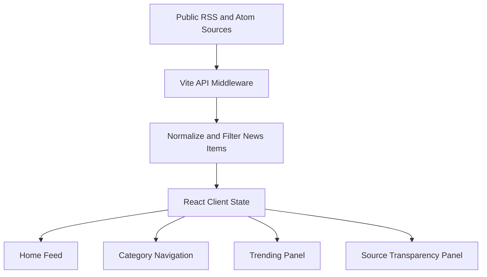

# 全球科技圈实时资讯聚合平台

Feature Name: global-tech-news-platform
Updated: 2026-04-29

## Description

平台采用轻量化前后端一体开发结构：前端使用 React + Vite 构建响应式资讯体验，开发期通过 Vite middleware 暴露 `/api/news` 和 `/api/meta` 聚合公开 RSS/Atom 信息源。页面强调极简科技风、双主题、卡片信息流、热榜、分类导航、搜索和真实来源标注。

## Product Architecture



## Page Modules

- 顶部导航：品牌、分类入口、搜索框、主题切换、刷新入口。
- Hero 聚合区：平台定位、实时源状态、核心能力文案。
- 分类导航：AI 大模型、芯片算力、开源生态、硅谷欧美、国内大厂、硬件数码、机器人、云计算、科研前沿、政策投融资。
- 信息流：资讯卡片、内容模式、地区标识、来源、时间、摘要、标签和原文链接。
- 热搜科技榜：根据当前资讯标签与关键词聚合热点。
- 来源透明面板：展示国内、海外、全球来源数量和失败源数量。
- 扩展能力区：AI 摘要、翻译、订阅、收藏、定时采集接口预留说明。

## Feature List

- 真实公开 RSS/Atom 实时拉取。
- 资讯搜索、分类筛选、内容模式筛选。
- 来源标注、地区区分、时间线倒序。
- 热搜标签聚合。
- 深色/浅色主题切换。
- 响应式桌面、平板、手机布局。
- 屏蔽词过滤。
- AI 摘要、翻译、订阅、收藏、定时采集接口占位。

## Visual System

- 色彩方案：深色背景 `#070B14`、浅色背景 `#F6F8FB`、主色 `#7DD3FC`、辅助紫 `#A78BFA`、成功绿 `#34D399`、文本灰 `#94A3B8`。
- 字体规范：系统无衬线字体栈 `Inter, ui-sans-serif, system-ui, -apple-system, BlinkMacSystemFont, Segoe UI, sans-serif`。
- 标题层级：H1 44-64px，H2 28-36px，卡片标题 18-22px，正文 15-16px，元信息 12-13px。
- UI 质感：玻璃拟态卡片、低饱和冷色渐变、微光边框、轻量阴影、充足留白。

## Navigation And Categories

- 首页：Global Feed
- AI 大模型：AI Models
- 芯片算力：Chips & Compute
- 开源生态：Open Source
- 硅谷欧美：Silicon Valley
- 国内大厂：China Tech
- 硬件数码：Devices
- 机器人：Robotics
- 云计算：Cloud
- 科研前沿：Research
- 政策投融：Policy & Funding

## Core Copy

- 主标题：全球科技动态，一屏掌握。
- 副标题：聚合 AI、大模型、芯片、开源、云计算、科研、政策与投融资等全球科技一手资讯。
- 搜索占位：搜索公司、技术、论文、开源项目或政策关键词。
- 空状态：没有匹配资讯，尝试更换关键词或分类。
- 合规说明：平台仅展示标题、短摘要、来源、时间与原文链接，内容版权归原发布方所有。

## Components and Interfaces

- `server/newsPlugin.js`：Vite middleware，提供 `/api/news` 与 `/api/meta`。
- `src/App.jsx`：页面状态、筛选逻辑、主题控制和布局组合。
- `src/main.jsx`：React 入口。
- `src/styles.css`：设计系统、响应式布局和动效。

### API Interfaces

- `GET /api/news?blocked=comma,separated,words`：返回聚合资讯、来源状态和更新时间。
- `GET /api/meta`：返回分类、内容模式、扩展接口和资讯源元信息。
- `POST /api/ai/summary`：预留 AI 摘要接口。
- `POST /api/translate`：预留翻译接口。
- `POST /api/subscriptions`：预留关键词订阅接口。
- `POST /api/bookmarks`：预留收藏接口。

## Data Models

```ts
type NewsItem = {
  id: string;
  title: string;
  summary: string;
  url: string;
  source: string;
  region: 'domestic' | 'overseas' | 'global';
  category: string;
  mode: 'flash' | 'deep' | 'technical';
  publishedAt: string;
  tags: string[];
};
```

## Correctness Properties

- 每条资讯项必须包含原文链接、来源和发布时间。
- 资讯项默认按 `publishedAt` 倒序排列。
- 第三方内容只展示短摘要，不复制全文。
- 屏蔽词过滤在服务端聚合阶段执行。

## Error Handling

- 单个 RSS 源失败不阻断整体响应。
- 所有源失败时返回空数组、错误计数和可恢复提示。
- 前端 API 请求失败时展示错误状态和重试按钮。

## Test Strategy

- 使用 `npm run build` 验证前端生产构建。
- 使用浏览器访问首页验证响应式布局、主题切换、搜索和筛选。
- 使用 `/api/news` 验证真实来源拉取和失败源容错。

## References

- The Verge RSS: https://www.theverge.com/rss/index.xml
- TechCrunch RSS: https://techcrunch.com/feed/
- MIT News RSS: https://news.mit.edu/rss/topic/artificial-intelligence2
- GitHub Blog RSS: https://github.blog/feed/
- Google AI Blog RSS: https://blog.google/technology/ai/rss/
- OpenAI Blog RSS: https://openai.com/news/rss.xml
