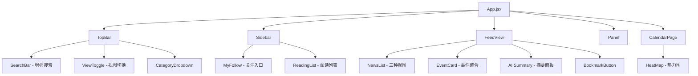

# Tech Radar 平台优化方案 - 技术设计文档

Feature Name: tech-radar-optimization
Updated: 2026-04-29

## Description

将 Tech Radar 从资讯聚合平台升级为信息消化平台，新增 AI 摘要、收藏、视图切换、个性化信息流、事件聚合、日历热力图、搜索增强、快捷键共8个功能模块。

## Architecture



## Components and Interfaces

### 1. AI 摘要组件 (AISummary)

- 位置：每条 NewsItem 内部，点击展开
- 触发：点击"AI 摘要"按钮
- 数据流：前端调用 `/api/ai/summary`，后端预留接口，前端先用规则摘要兜底
- 兜底方案：提取标题关键词 + 摘要前80字 + 来源，生成结构化摘要
- 缓存：已生成的摘要存入 localStorage，key = `summary-{item.id}`

### 2. 收藏/阅读列表 (BookmarkSystem)

- 状态管理：useState + localStorage
- 数据结构：`{ id, itemId, title, url, source, savedAt, isRead }`
- UI：侧边栏新增"阅读列表"入口，弹出面板展示
- 交互：每条资讯右侧收藏星标按钮，点击切换

### 3. 视图切换 (ViewMode)

- 三种模式：compact(紧凑) / standard(标准) / card(卡片)
- 状态持久化：localStorage key `viewMode`
- 紧凑模式：隐藏摘要，标题单行，行高压缩
- 卡片模式：完整摘要，标签完整展示，hover 放大效果

### 4. 自定义信息流 (FollowSystem)

- 数据结构：`{ keywords: string[], categories: string[] }`
- 过滤逻辑：匹配关键词的条目标注"关注"标记，排序优先
- 侧边栏入口："我的关注"显示关注的赛道数量

### 5. 事件关联聚合 (EventCluster)

- 算法：标题关键词提取 -> TF-IDF 相似度 -> 阈值 0.6 聚合
- 前端实现：useMemo 计算事件组
- 展示：事件卡头部显示"3家媒体报道"，展开后显示各来源

### 6. 日历热力图 (CalendarHeatMap)

- 数据来源：items 按日期分组计数
- 色阶：5级，从 `rgba(56,189,248,0.05)` 到 `rgba(56,189,248,0.4)`
- 点击日期展示当日资讯列表

### 7. 搜索增强 (SearchEnhanced)

- 搜索历史：localStorage key `searchHistory`，最多20条
- 实时建议：基于 items 标题前缀匹配
- 排序：相关度(关键词命中数) / 时间 两种

### 8. 快捷键 (KeyboardShortcuts)

- useEffect 监听 keydown 事件
- 焦点索引管理：focusedIndex state
- 焦点样式：.news-item.focused 类
- 帮助面板：按 ? 弹出 modal

## Data Models

```typescript
interface Bookmark {
  id: string;
  itemId: string;
  title: string;
  url: string;
  source: string;
  savedAt: string;
  isRead: boolean;
}

interface FollowConfig {
  keywords: string[];
  categories: string[];
}

interface EventCluster {
  id: string;
  keyword: string;
  items: NewsItem[];
}

interface SearchHistory {
  query: string;
  searchedAt: string;
}

interface ViewConfig {
  mode: 'compact' | 'standard' | 'card';
}
```

## Correctness Properties

1. 收藏操作是幂等的：重复收藏不会创建重复记录
2. 视图切换不影响当前筛选状态
3. 快捷键仅在非输入框聚焦时生效
4. 事件聚合不会遗漏任何条目——未匹配的条目作为独立事件
5. 热力图数据与资讯列表数据一致

## Error Handling

1. AI 摘要生成失败 -> 显示兜底规则摘要 + "AI 摘要暂不可用"
2. localStorage 写入失败 -> 静默降级为内存存储
3. 事件聚合计算超时 -> 降级为普通列表展示
4. 搜索建议匹配为空 -> 显示热门标签

## Test Strategy

1. 单元测试：关键词匹配算法、事件聚合算法
2. 集成测试：收藏 -> 阅读列表展示 -> 删除 流程
3. 交互测试：视图切换保持筛选状态、快捷键不与输入框冲突
4. 性能测试：150条资讯下事件聚合计算 < 200ms

## Implementation Order

| Phase | Features | Est. Effort |
|-------|----------|-------------|
| Phase 1 | 收藏/阅读列表 + 视图切换 | 1 session |
| Phase 2 | AI 智能摘要 + 自定义信息流 | 1 session |
| Phase 3 | 事件关联 + 日历热力图 | 1 session |
| Phase 4 | 搜索增强 + 快捷键 | 1 session |
