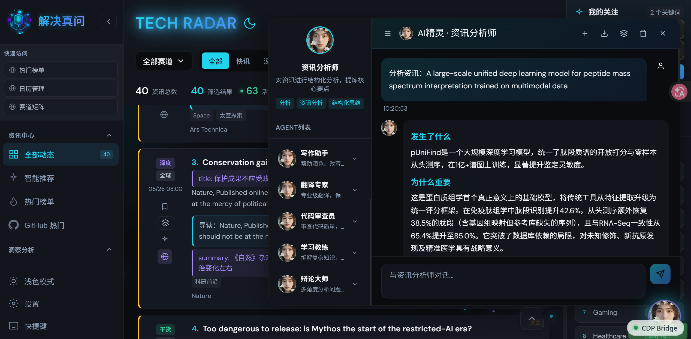
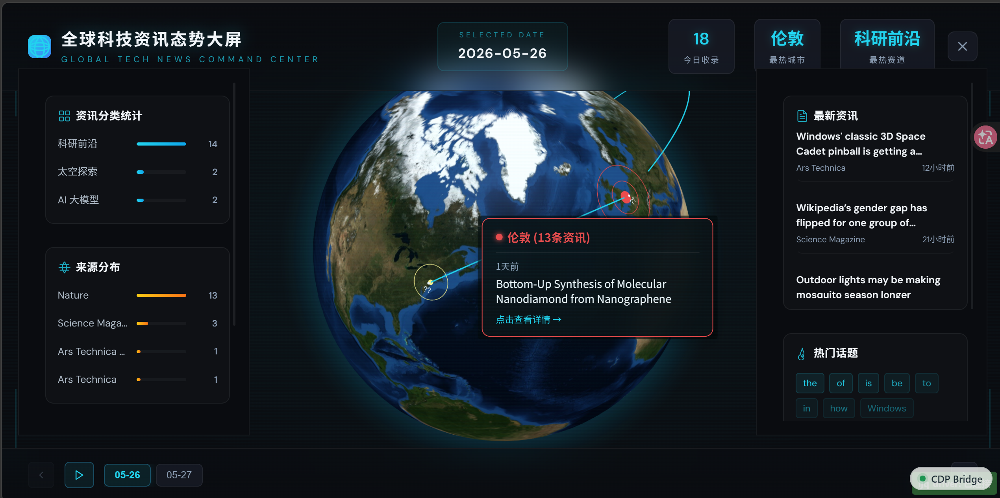
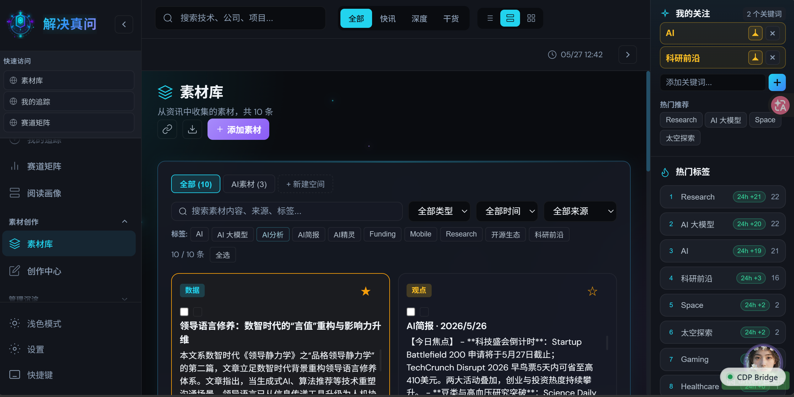

# Global Tech Radar

全球科技圈实时资讯聚合平台，聚合公开 RSS/Atom 科技资讯源，展示 AI、大模型、芯片、开源、科研、政策、投融资、硬件与云计算动态。

## 界面预览

### 主界面与资讯流



聚合信息流首页，支持分类导航、热搜科技榜、搜索、来源标注和时间线排序。支持深色/浅色双主题和响应式布局。

### AI Elf 智能助手



AI Elf 智能助手系统，支持多 Agent 对话、新闻拖拽分析、历史会话管理和 AI 摘要生成。

### 信息源管理与设置



信息源管理中心，支持自定义与内置源批量管理、健康监测、导入导出和高级搜索筛选。

## 核心能力

### 实时资讯聚合

- 真实公开 RSS/Atom 实时拉取：The Verge、TechCrunch、MIT News AI、GitHub Blog、Google AI Blog、OpenAI News、Solidot、Cnblogs News、ArXiv CS AI 等。
- 首页聚合信息流、分类导航、热搜科技榜、搜索、来源标注和时间线排序。
- 实时快讯、深度解读、技术干货三类内容模式。
- 国内源、海外源、全球源标识。
- 屏蔽词过滤和合规来源说明。

### AI Elf 智能助手

- 多 Agent 对话系统，支持 8 种预定义 Agent 角色。
- 新闻卡片拖拽分析，一键获取 AI 深度解读。
- 每 Agent 独立的对话历史与会话管理。
- AI 摘要、翻译、续写、改写、扩写、简化、标题生成。
- 支持自定义 Agent 创建、头像上传、提示词编辑。
- 分析结果可导出至素材库。

### 信息源管理

- 自定义信息源与内置信息源双列表管理。
- 批量操作：全选、启用、禁用、删除。
- 来源健康监测：响应状态、响应时间、失败次数、条目数。
- 自动验证：可配置验证间隔，实时监控来源可用性。
- 高级搜索：支持名称、URL、标签、分类多维度检索。
- 多条件筛选：按状态、区域、健康状况过滤。
- 导入导出：支持 JSON 格式批量导入导出。
- 一键验证全部来源，并行检测并展示结果。

### 3D 地球可视化

- `react-globe.gl` 驱动的交互式 3D 地球。
- 全屏仪表盘模式，支持数据点可视化展示。
- 自适应画布尺寸，确保渲染质量。

### 主题与布局

- 深色/浅色双主题切换。
- 响应式布局，适配多端显示。
- 左侧边栏可折叠，内容区自适应宽度。

## 技术栈

- **Frontend**: React 18 + Vite
- **Styling**: Custom CSS (~3150 lines) with CSS custom properties for themes, Tailwind CSS configuration
- **3D Visualization**: react-globe.gl (Three.js based)
- **API Layer**: Vite middleware plugin (`server/newsPlugin.js`) for development, Vercel serverless functions for production
- **Data Fetching**: Native `fetch` for RSS/Atom aggregation
- **Storage**: localStorage for user preferences, Agent messages, source health

## API 端点

| Endpoint | Method | 参数 | 说明 |
|---|---|---|---|
| `/api/news` | GET | `blocked=word1,word2`, `custom=<JSON>` | 聚合 RSS 实时资讯 |
| `/api/meta` | GET | — | 分类、模式、来源元信息 |
| `/api/trending` | GET | — | AI 过滤热搜科技榜 |
| `/api/github-trending` | GET | `lang=python`, `since=daily\|weekly\|monthly` | GitHub 趋势仓库 |
| `/api/verify-source` | GET | `url=<RSS_URL>` | 验证 RSS/Atom 源有效性 |
| `/api/llm-models` | GET | `baseUrl`, `apiKey` | 获取 LLM 可用模型列表 |
| `/api/llm-test` | POST | `baseUrl`, `model`, `apiKey` | 测试 LLM API 连通性 |
| `/api/ai-insights` | POST | `baseUrl`, `apiKey`, `model`, `items[]` | AI 分析 Top 30 资讯，返回趋势与信号 |
| `/api/ai-generate` | POST | `baseUrl`, `apiKey`, `model`, `action`, `content` | LLM 内容生成（续写、改写、扩写、简化、翻译、标题、摘要） |

## 本地运行

```bash
# 安装依赖
npm install

# 启动开发服务器（端口 5175）
npm run dev

# 生产构建
npm run build

# 预览生产构建
npm run preview
```

开发服务器会暴露以下接口：

- `GET /api/news`：聚合实时资讯。
- `GET /api/news?blocked=word1,word2`：按屏蔽词过滤资讯。
- `GET /api/meta`：返回分类、模式、来源与扩展能力元信息。
- `POST /api/ai-generate`、`POST /api/ai-insights`、`POST /api/translate`、`POST /api/subscriptions`、`POST /api/bookmarks`：AI 与扩展接口。

## 🚀 部署指南

### 快速部署（推荐）

```bash
# 方式一：Docker 部署（最简单）
chmod +x docker-deploy.sh
./docker-deploy.sh

# 方式二：手动安装
chmod +x install_dependencies.sh
./install_dependencies.sh
```

### 部署到其他环境

本项目支持部署到任何环境（本地、服务器、云端），包括：

- ✅ **跨平台**：支持 Linux、macOS、Windows
- ✅ **容器化**：提供 Docker 和 Docker Compose 配置
- ✅ **生产就绪**：支持 Gunicorn + Nginx 部署
- ✅ **Scrapling 集成**：完整的网页抓取功能随项目一起部署

详细部署说明请查看：
- [快速部署指南](DEPLOYMENT_QUICK.md)
- [完整部署文档](DEPLOYMENT.md)
- [Scrapling 集成说明](SCRAPLING_INTEGRATION.md)

### 部署特性

- 📦 **一键部署**：Docker 方案支持一键启动
- 🔄 **依赖自动安装**：Python、Node.js、浏览器依赖自动安装
- 🛠 **配置简化**：提供环境变量模板和配置示例
- 📊 **健康检查**：内置服务健康监控和日志管理
- 🔒 **生产安全**：包含安全配置建议和最佳实践

### 部署后访问

- **前端界面**：http://localhost（或你的域名）
- **Scrapling API**：http://localhost:5000/api/scrape
- **健康检查**：http://localhost:5000/api/health

## 项目结构

```
.
├── src/
│   ├── App.jsx           # 主应用（~5600 行），状态、渲染、业务逻辑
│   ├── AiElf.jsx         # AI Elf 组件（~950 行），Agent 系统与对话
│   ├── GlobeView.jsx     # 3D 地球可视化（~880 行）
│   ├── main.jsx          # 入口，挂载 App
│   └── styles.css        # 全局样式（~3150 行）
├── server/
│   └── newsPlugin.js     # Vite 中间件 API（~1300 行）
├── api/                  # Vercel serverless 函数
├── public/               # 静态资源、PWA manifest、Service Worker
├── vite.config.js        # Vite 配置（端口 5175）
└── vercel.json           # Vercel 部署配置
```

## 合规说明

平台仅展示标题、短摘要、来源、发布时间、标签和原文链接，内容版权归原发布方所有。上线生产环境时建议增加来源白名单、缓存策略、速率限制、robots 与服务条款审查流程。
